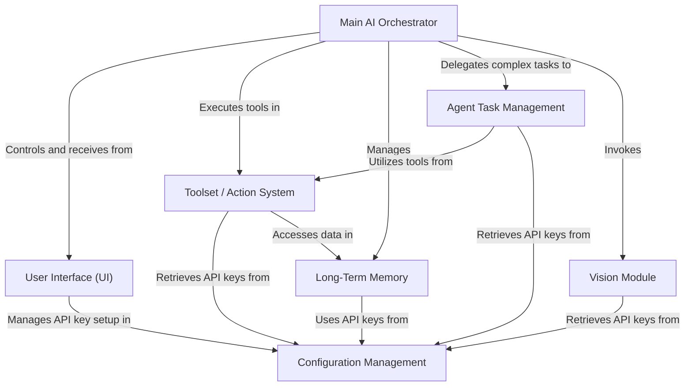

# MAX-5.0

MAX-5.0 is an advanced **AI assistant** designed to interact with your computer via a futuristic UI, a central **AI Orchestrator**, and a modular tool/action system. This repository contains a generated, chapter-based tutorial that explains how the system works end-to-end.

## ✨ Key Features

- **Futuristic UI (Tkinter):** conversation log, command input, mute/state indicator, and animated “face”.
- **Main AI Orchestrator:** interprets user input, selects tools, executes actions, and reports results.
- **Agent Task Management:** handles complex, multi-step goals using planning, execution, retries, and replanning.
- **Toolset / Action System:** a catalog of callable tools (e.g., open apps, web search, weather, file control).
- **Long-Term Memory:** stores and retrieves context across sessions.
- **Configuration Management:** manages API keys and environment configuration.
- **Vision Module:** enables image/screen understanding (where supported).

---

## 🧭 Visual Overview

---

