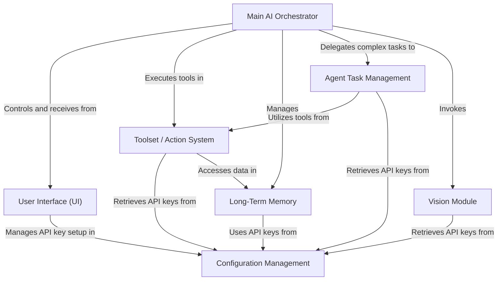

# MAX-5.0

MAX-5.0 is an advanced **AI assistant** designed to interact with your computer via a futuristic UI, a central **AI Orchestrator**, and a modular tool/action system. This repository contains a generated, chapter-based tutorial that explains how the system works end-to-end.

## ✨ Key Features

- **Futuristic UI (Tkinter):** conversation log, command input, mute/state indicator, and animated “face”.
- **Main AI Orchestrator:** interprets user input, selects tools, executes actions, and reports results.
- **Agent Task Management:** handles complex, multi-step goals using planning, execution, retries, and replanning.
- **Toolset / Action System:** a catalog of callable tools (e.g., open apps, web search, weather, file control).
- **Long-Term Memory:** stores and retrieves context across sessions.
- **Configuration Management:** manages API keys and environment configuration.
- **Vision Module:** enables image/screen understanding (where supported).

---

## 🧭 Visual Overview

---

## 📚 Tutorial Chapters

1. [User Interface (UI)](01_user_interface__ui__.md)
2. [Main AI Orchestrator](02_main_ai_orchestrator_.md)
3. [Agent Task Management](03_agent_task_management_.md)
4. [Toolset / Action System](04_toolset___action_system_.md)
5. [Vision Module](05_vision_module_.md)
6. [Long-Term Memory](06_long_term_memory_.md)
7. [Configuration Management](07_configuration_management_.md)

---

## ✅ How to Use This Repository

- Start with **Chapter 1** to understand the UI and how user commands enter the system.
- Continue through the chapters in order to see how MAX interprets input, plans multi-step tasks, and executes tools.
- Use the mermaid diagrams as a quick mental model for how components interact.

---

## ℹ️ Notes

This tutorial content was generated by **AI Codebase Knowledge Builder**: https://github.com/The-Pocket/Tutorial-Codebase-Knowledge
